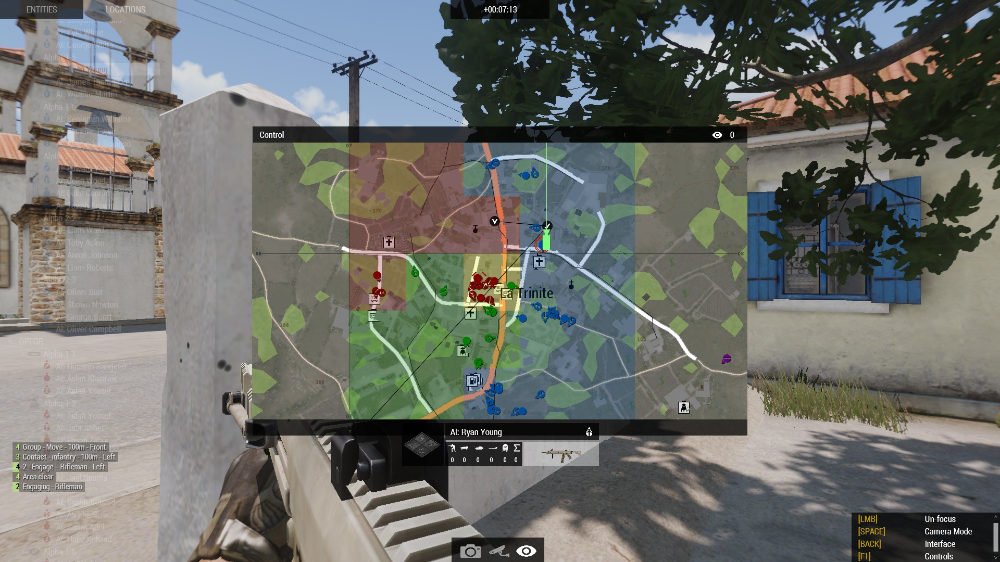

# A3_zone_control_map_set
Script set to play a "zone control" game mode on Arma 3.

## Gamemode description
This script allows up to 3 teams (sides) to fight to control a region (can be a city or something else) by taking over all the parts of the region following a grid pattern.
A unit or group must be the only team in the zone to take control of it. The zone will be colored in the team color on the map.
If two or more teams are in the same zone, the zone will be colored in yellow and will remain as this until only one team is remaining in the zone.
Controlling the zones allows the given team to respawn inside them and to spawn more squads at the time.
If there is no zones remaining for respawn, the concerned team lose.
The team controlling all the zones wins.

This script set is useful to quickly get into a quick (15~45 minutes) CQC fight alone or in multiplayer. 

## Features

- Easy installation

- Can virtually be applied to any map, official or not

- Does not require mods on client's side

- Mission settings can be adjusted in the multiplayer lobby

## Gamemode installation

1. Create a new map using 3den Editor. Save it as a multiplayer map (mpmissions).

2. Copy and paste the files inside the mission folder (e.g. : I made a Malder2035 map named "Control", the mission folder path will be : `C:\Users\echoffee\Documents\Arma 3\mpmissions\Control.Malden`)

3. ⚠️🔨WIP🔨⚠️

